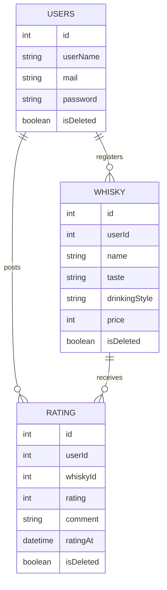

```mermaid
erDiagram
    USERS ||--o{ RATING : posts
    WHISKY ||--o{ RATING : receives
    USERS ||--o{ WHISKY : registers

    USERS {
        int id
        string userName
        string mail
        string password
        boolean isDeleted
    }

    WHISKY {
        int id
        int userId
        string name
        string taste
        string drinkingStyle
        int price
        boolean isDeleted
    }

    RATING {
        int id
        int userId
        int whiskyId
        int rating
        string comment
        datetime ratingAt
        boolean isDeleted
    }

```